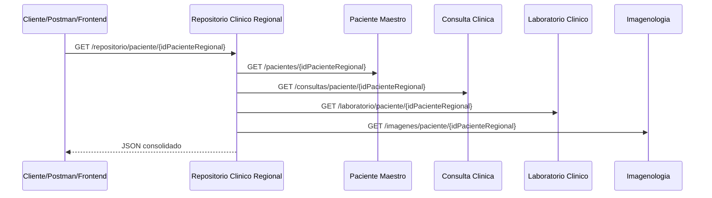

# Avance 2 - Repositorio Clinico Regional e integracion

## Objetivo del avance

El segundo avance tuvo como objetivo convertir el Repositorio Clinico Regional en un agregador real. En esta fase el repositorio ya no solo existe como microservicio base, sino que consume los microservicios de Paciente Maestro, Consulta Clinica, Laboratorio e Imagenologia mediante APIs REST y devuelve una respuesta consolidada por paciente.

## Que hicimos

Se implemento la integracion del microservicio `repositorio-clinico-regional-service` con los microservicios clinicos:

- `paciente-maestro-service`
- `consulta-clinica-service`
- `laboratorio-clinico-service`
- `imagenologia-service`

El endpoint principal solicitado fue implementado:

```http
GET /repositorio/paciente/{idPacienteRegional}
```

Tambien se agrego consulta por cedula:

```http
GET /repositorio/cedula/{cedula}
```

## Como lo hicimos

El repositorio usa comunicacion REST mediante `RestTemplate`. Las URLs de los microservicios se configuran por variables:

```properties
servicios.paciente-url
servicios.consulta-url
servicios.laboratorio-url
servicios.imagenologia-url
```

En Docker Compose estas rutas apuntan a los nombres internos de los contenedores:

```yaml
PACIENTE_SERVICE_URL: http://paciente-maestro-service:8081
CONSULTA_SERVICE_URL: http://consulta-clinica-service:8082
LABORATORIO_SERVICE_URL: http://laboratorio-clinico-service:8083
IMAGENOLOGIA_SERVICE_URL: http://imagenologia-service:8084
```

Esto demuestra que la comunicacion se hace por APIs REST entre servicios y no por acceso directo entre bases de datos.

## Diagrama actualizado de integracion

El diagrama de integracion REST esta disponible en:

`documentacion/assets/diagrama_integracion_rest_solca.png`

Flujo logico:



## Respuesta JSON consolidada

El endpoint devuelve el formato exigido:

```json
{
  "paciente": {},
  "consultas": [],
  "laboratorio": [],
  "imagenes": [],
  "errores": {}
}
```

El campo `errores` se agrego para evidenciar manejo basico de fallos cuando algun microservicio no responde.

## No acceso directo entre bases de datos

El cumplimiento se evidencia en la clase:

`repositorio-clinico-regional-service/src/main/java/ec/edu/solca/repositorio/service/RepositorioIntegracionService.java`

El repositorio no abre conexiones a `paciente_maestro_db`, `consulta_clinica_db`, `laboratorio_clinico_db` ni `imagenologia_db`. En lugar de eso llama endpoints REST:

- `/pacientes/{idPacienteRegional}`
- `/consultas/paciente/{idPacienteRegional}`
- `/laboratorio/paciente/{idPacienteRegional}`
- `/imagenes/paciente/{idPacienteRegional}`

Cada microservicio sigue siendo responsable de consultar su propia base.

## Manejo basico de errores

Si un microservicio no responde, el repositorio captura la excepcion y devuelve una respuesta parcial. La informacion disponible de los demas servicios sigue apareciendo.

Ejemplo esperado si laboratorio esta apagado:

```json
{
  "paciente": {},
  "consultas": [],
  "laboratorio": [],
  "imagenes": [],
  "errores": {
    "laboratorio-clinico": "No se pudo consultar el microservicio"
  }
}
```

Esto permite demostrar resiliencia basica y consolidacion parcial.

## Infraestructura de datos

| Tipo | Implementacion |
| --- | --- |
| Datos estructurados | Pacientes, consultas, laboratorio e imagenologia guardados en PostgreSQL. |
| Datos no estructurados | Archivos DICOM y metadatos de imagenologia en el microservicio de imagenologia. |
| DBaaS | PostgreSQL puede migrarse a un servicio administrado manteniendo las bases independientes. |
| Storage cloud | Propuesto para archivos DICOM, respaldos y objetos clinicos no estructurados. |

## Matriz preliminar de riesgos

| Riesgo | Impacto | Mitigacion inicial |
| --- | --- | --- |
| Microservicio no disponible | Respuesta incompleta | Manejo de errores por servicio y consolidacion parcial. |
| Duplicidad de pacientes | Informacion fragmentada | Uso de `idPacienteRegional` como identificador maestro. |
| Acceso indebido a datos clinicos | Exposicion de informacion sensible | Seguridad JWT reforzada en Avance 3. |
| Acoplamiento entre bases de datos | Dificultad de mantenimiento | Comunicacion REST y base independiente por microservicio. |
| Perdida de datos | Riesgo asistencial | PostgreSQL persistente y plan de respaldo en Avance 3. |

## Evidencias disponibles

| Evidencia solicitada | Donde esta en el proyecto |
| --- | --- |
| Diagrama actualizado de integracion | `documentacion/assets/diagrama_integracion_rest_solca.png`. |
| Comunicacion REST entre servicios | `RepositorioIntegracionService.java`. |
| Respuesta JSON consolidada | Endpoint `GET /repositorio/paciente/{idPacienteRegional}`. |
| No acceso directo entre bases | Configuracion por URLs REST en `docker-compose.yml`. |
| Manejo de errores | Metodos `obtenerObjeto` y `obtenerLista` devuelven errores por servicio. |
| Pruebas Postman | `postman/SOLCA-Repositorio-Clinico-Regional.postman_collection.json`. |

## Cumplimiento de la rubrica

| Requisito | Estado | Explicacion |
| --- | --- | --- |
| Diagrama actualizado de integracion | Cumple | Existe diagrama REST en `documentacion/assets`. |
| Explicacion de APIs REST | Cumple | El repositorio consume endpoints HTTP de cada microservicio. |
| Infraestructura de datos | Cumple | Se documentan datos estructurados, DICOM, DBaaS y storage cloud. |
| Matriz preliminar de riesgos | Cumple | Incluida en este documento y en la documentacion general. |
| Consumo de Paciente Maestro | Cumple | `GET /pacientes/{id}` desde repositorio. |
| Consumo de Consulta Clinica | Cumple | `GET /consultas/paciente/{id}` desde repositorio. |
| Consumo de Laboratorio | Cumple | `GET /laboratorio/paciente/{id}` desde repositorio. |
| Consumo de Imagenologia | Cumple | `GET /imagenes/paciente/{id}` desde repositorio. |
| Endpoint obligatorio | Cumple | `GET /repositorio/paciente/{idPacienteRegional}` implementado. |
| Respuesta JSON consolidada | Cumple | Devuelve paciente, consultas, laboratorio, imagenes y errores. |
| No acceso directo entre bases | Cumple | Integracion por REST, no por consultas SQL cruzadas. |
| Manejo de errores si un servicio cae | Cumple | Devuelve informacion parcial y mensaje en `errores`. |

## Conclusion

El Avance 2 queda cubierto porque el repositorio regional integra los microservicios mediante REST, consolida la informacion clinica por paciente y maneja fallos parciales. La arquitectura respeta la independencia de bases de datos y prepara el sistema para seguridad, frontend y contenedores del Avance 3.
