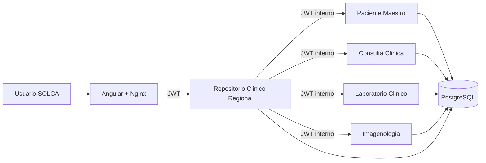

# Avance 3 - Frontend, seguridad y contenedores

## Diseno final de arquitectura



- Frontend: `solca-repositorio-angular`, publicado en contenedor Nginx.
- Puerta de entrada clinica: `repositorio-clinico-regional-service`.
- Microservicios internos: paciente maestro, consulta clinica, laboratorio e imagenologia.
- Persistencia: una instancia PostgreSQL con bases separadas por microservicio.

## Estrategia de seguridad

- Autenticacion JWT en `POST /auth/login`.
- Roles disponibles: `ADMIN`, `MEDICO`, `LABORATORIO`.
- Validacion stateless con Spring Security en todos los microservicios.
- Control por endpoint con `@PreAuthorize`.
- El repositorio regional llama a los microservicios internos usando un JWT de servicio.
- La clave se configura con `JWT_SECRET` y queda centralizada en `docker-compose.yml` para la demo.

## Control de acceso por endpoint

| Servicio | Endpoint | Roles |
| --- | --- | --- |
| Repositorio regional | `GET /repositorio/paciente/{id}` | ADMIN, MEDICO |
| Repositorio regional | `GET /repositorio/cedula/{cedula}` | ADMIN, MEDICO |
| Repositorio regional | `GET /repositorio/auditoria` | ADMIN |
| Paciente maestro | `GET /pacientes/**` | ADMIN, MEDICO |
| Paciente maestro | `POST /pacientes` | ADMIN |
| Consulta clinica | `GET /consultas/**` | ADMIN, MEDICO |
| Consulta clinica | `POST /consultas` | ADMIN |
| Laboratorio clinico | `GET /laboratorio/**` | ADMIN, MEDICO, LABORATORIO |
| Laboratorio clinico | `POST /laboratorio` | ADMIN, LABORATORIO |
| Imagenologia | `GET /imagenes/**` | ADMIN, MEDICO |
| Imagenologia | `POST /imagenes` | ADMIN |

## Auditoria basica

Cada consulta consolidada guarda un registro en `registro_consultas_repositorio` con:

- `idPacienteRegional`
- `criterioBusqueda`
- `usuario`
- `rol`
- `endpoint`
- `fechaConsultaRepositorio`
- `resultado`

El frontend muestra la auditoria solo cuando se inicia sesion como `ADMIN`.

## Matriz de riesgos actualizada

| Riesgo | Probabilidad | Impacto | Mitigacion |
| --- | --- | --- | --- |
| Acceso no autorizado a historias clinicas | Media | Alto | JWT, roles y validacion por endpoint. |
| Indisponibilidad de un microservicio | Media | Medio | Timeouts REST, respuesta consolidada parcial y mensajes por servicio. |
| Perdida de datos PostgreSQL | Baja | Alto | Volumen Docker persistente y plan de respaldo con `pg_dump`. |
| Exposicion de secretos | Media | Alto | Uso de variables de entorno; en cloud usar secret manager. |
| Fallo de despliegue por dependencias | Media | Medio | Dockerfile por servicio y Compose unico para reconstruccion. |
| Auditoria insuficiente | Baja | Medio | Registro de usuario, rol, criterio, endpoint y resultado. |

## Plan de respaldo y recuperacion

Respaldo local:

```powershell
docker exec solca-postgres pg_dumpall -U solca > backup-solca.sql
```

Restauracion local:

```powershell
Get-Content backup-solca.sql | docker exec -i solca-postgres psql -U solca -d solca_admin
```

Frecuencia recomendada:

- Diario para ambiente de pruebas.
- Antes de cada entrega academica.
- Antes de cambios de esquema o carga masiva de datos.

## Plan cloud

- Contenerizar todos los servicios con las imagenes actuales.
- Publicar imagenes en un registry privado.
- Desplegar en Kubernetes o ECS/Cloud Run, segun disponibilidad institucional.
- Usar PostgreSQL administrado.
- Reemplazar `JWT_SECRET` de Compose por secret manager.
- Exponer solo frontend y repositorio regional; mantener microservicios clinicos en red privada.
- Activar logs centralizados, metricas y alarmas por disponibilidad.

## Evidencia de contenedores

El repositorio incluye:

- Dockerfile por microservicio Spring Boot.
- Dockerfile para Angular con Nginx.
- `docker-compose.yml` para PostgreSQL, backend completo y frontend.

Comando de ejecucion:

```powershell
docker compose up --build
```

URLs esperadas:

- Frontend: `http://localhost:8080`
- Repositorio regional: `http://localhost:8085`

## Validacion funcional esperada

1. Iniciar sesion como `MEDICO`.
2. Buscar por ID regional: `REG-0001`.
3. Buscar por cedula: `0102030405`.
4. Ver paciente, consultas, laboratorio e imagenologia consolidados.
5. Detener un microservicio y confirmar el mensaje en "Servicios no disponibles".
6. Iniciar sesion como `ADMIN` y consultar auditoria.
7. Probar que `LABORATORIO` no puede consultar la historia consolidada completa.
