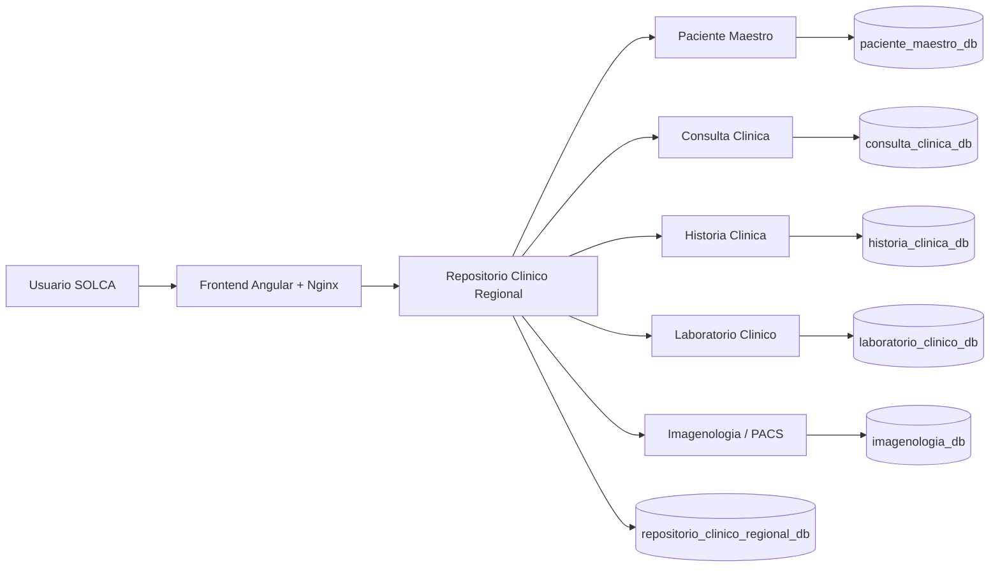

# Avance 3 - Frontend, seguridad y contenedores

## Objetivo del avance

El tercer avance tuvo como objetivo completar el sistema con interfaz grafica, seguridad por JWT/Spring Security, roles, auditoria basica y ejecucion en contenedores. En esta fase el repositorio ya no se prueba solo por Postman, sino tambien desde una aplicacion Angular desplegada en contenedor Nginx.

## Que hicimos

Se implemento y conecto un frontend Angular con el Repositorio Clinico Regional. La aplicacion permite:

- Iniciar sesion con usuario y contrasena.
- Registrar nuevos usuarios clinicos.
- Buscar pacientes por cedula ecuatoriana o Master ID regional.
- Visualizar informacion clinica consolidada.
- Ver perfil del paciente.
- Ver historia clinica.
- Ver consultas clinicas.
- Ver laboratorio.
- Ver imagenologia.
- Enviar y visualizar archivos DICOM cuando existen.
- Mostrar mensajes si algun microservicio no esta disponible.
- Consultar auditoria basica.

Tambien se agrego seguridad JWT con roles `ADMIN`, `MEDICO` y `LABORATORIO`, Dockerfile por servicio y despliegue por Docker Compose.

## Como lo hicimos

### Frontend

El frontend esta en el repositorio:

`solca-repositorio-frontend`

Archivos principales:

- `src/app/app.html`
- `src/app/app.ts`
- `src/app/services/repositorio-clinico.ts`
- `Dockerfile`
- `nginx.conf`

La aplicacion Angular consume el backend por rutas `/api`, que son redirigidas por Nginx al microservicio de repositorio regional.

### Seguridad

La seguridad se implemento con:

- JWT.
- Spring Security.
- Filtros de autenticacion por token.
- Roles `ADMIN`, `MEDICO`, `LABORATORIO`.
- Control de acceso por endpoint con `@PreAuthorize`.
- Login en `POST /auth/login`.
- Registro de usuarios en `POST /auth/register`.

Cada microservicio contiene paquete `security` con:

- `SecurityConfig.java`
- `JwtService.java`
- `JwtAuthenticationFilter.java`
- `JwtPrincipal.java`

### Auditoria

El repositorio registra auditoria basica de acciones relevantes. La auditoria contiene los campos minimos solicitados:

- usuario
- rol
- fecha
- hora
- direccion IP
- modulos
- paciente
- accion
- resultados

El frontend permite consultar auditoria desde el menu lateral.

### Contenedores

Cada microservicio backend tiene su propio `Dockerfile`:

- `paciente-maestro-service/Dockerfile`
- `consulta-clinica-service/Dockerfile`
- `laboratorio-clinico-service/Dockerfile`
- `imagenologia-service/Dockerfile`
- `historia-clinica-service/Dockerfile`
- `repositorio-clinico-regional-service/Dockerfile`

El frontend tambien tiene Dockerfile:

- `solca-repositorio-frontend/Dockerfile`

La ejecucion integrada se realiza con:

- `docker-compose.yml`
- `docker-compose.vps.yml`

## Diseno final de arquitectura

La arquitectura final queda compuesta por:

- Frontend Angular en Nginx.
- Repositorio Clinico Regional como API principal.
- Microservicios internos por dominio clinico.
- PostgreSQL con bases independientes.
- JWT compartido para validacion de seguridad.
- Red interna Docker para comunicacion entre servicios.



## Estrategia de seguridad

| Elemento | Implementacion |
| --- | --- |
| Autenticacion | Login con usuario y contrasena, generacion de JWT. |
| Autorizacion | Roles `ADMIN`, `MEDICO`, `LABORATORIO`. |
| Proteccion de endpoints | `@PreAuthorize` en controladores. |
| Sesion | Stateless; el token viaja en `Authorization: Bearer`. |
| Secretos | `JWT_SECRET` configurado en Compose; en cloud debe migrarse a secret manager. |
| Validaciones | Cedula ecuatoriana, nombres con letras, campos obligatorios por formulario. |

## Estrategia de auditoria

La auditoria se implemento en el repositorio regional para registrar consultas y acciones importantes. Esto permite saber que usuario consulto, que rol tenia, desde que IP, que modulo uso, que paciente consulto y cual fue el resultado.

La vista de auditoria se encuentra en el frontend y consume:

```http
GET /repositorio/auditoria
```

## Matriz de riesgos actualizada

| Riesgo | Probabilidad | Impacto | Mitigacion |
| --- | --- | --- | --- |
| Acceso no autorizado a informacion clinica | Media | Alto | JWT, roles y control por endpoint. |
| Caida de un microservicio | Media | Medio | Consolidacion parcial y mensajes de servicio no disponible. |
| Perdida de datos | Baja | Alto | Volumen persistente de PostgreSQL y plan de respaldo. |
| Exposicion de secretos | Media | Alto | Variables de entorno; recomendacion de secret manager en cloud. |
| Fallo de contenedores | Media | Medio | Dockerfile por servicio y Compose para reconstruccion. |
| Auditoria incompleta | Baja | Medio | Campos de auditoria ampliados: usuario, rol, fecha, hora, IP, modulo, paciente, accion y resultado. |

## Plan de respaldo y recuperacion

Respaldo recomendado:

```bash
docker exec solca-av3-postgres pg_dumpall -U solca_av3 > backup-solca-av3.sql
```

Restauracion recomendada:

```bash
cat backup-solca-av3.sql | docker exec -i solca-av3-postgres psql -U solca_av3 -d solca_admin
```

Frecuencia recomendada:

- Antes de cada entrega.
- Antes de cambios de esquema.
- Antes de cargar informacion masiva.
- Diario en ambiente productivo.

## Diagrama con frontend, seguridad y cloud

El diagrama final se documenta en:

`docs/avance-3-frontend-seguridad-contenedores.md`

Tambien existen diagramas generados en:

- `documentacion/assets/diagrama_arquitectura_cloud_solca.png`
- `documentacion/assets/diagrama_componentes_cloud_solca.png`
- `documentacion/assets/diagrama_integracion_rest_solca.png`

## Cumplimiento de interfaz grafica

| Requisito | Estado | Explicacion |
| --- | --- | --- |
| Buscar paciente por cedula o ID regional | Cumple | Dashboard permite buscar por cedula ecuatoriana o Master ID. |
| Visualizar informacion clinica consolidada | Cumple | El frontend consume el endpoint consolidado del repositorio. |
| Mostrar historias clinicas locales por sede | Cumple | Se agrego modulo de historia clinica con sede de registro/apertura. |
| Mostrar consultas | Cumple | Vista de consultas y registro de nuevas consultas. |
| Mostrar laboratorio | Cumple | Vista de laboratorio y registro segun rol. |
| Mostrar imagenologia | Cumple | Vista de imagenologia, envio DICOM y visor si hay archivo disponible. |
| Mostrar mensaje si un servicio no esta disponible | Cumple | Seccion "Servicios no disponibles" muestra errores por microservicio. |

## Cumplimiento de seguridad

| Requisito | Estado | Explicacion |
| --- | --- | --- |
| JWT o Spring Security | Cumple | JWT y Spring Security en backend. |
| Roles ADMIN, MEDICO, LABORATORIO | Cumple | Roles implementados en login, registro y control por endpoint. |
| Control de acceso por endpoint | Cumple | Uso de `@PreAuthorize` y filtros JWT. |
| Auditoria basica | Cumple | Registro y vista de auditoria con los campos solicitados. |

## Cumplimiento de contenedores

| Requisito | Estado | Explicacion |
| --- | --- | --- |
| Dockerfile para cada microservicio | Cumple | Cada microservicio backend tiene `Dockerfile`. |
| Evidencia de construccion de imagenes | Cumple tecnicamente | `docker compose build` construye las imagenes; se deben anexar capturas si el docente las exige. |
| Evidencia de ejecucion en contenedores | Cumple tecnicamente | `docker compose up -d` ejecuta los contenedores; se deben anexar capturas de `docker ps`. |

## Evidencias disponibles

| Evidencia | Ruta o comando |
| --- | --- |
| Frontend Angular | Repositorio `solca-repositorio-frontend`. |
| Backend completo | Repositorio `solca-repositorio-backend`. |
| Docker Compose local | `docker-compose.yml`. |
| Docker Compose VPS | `docker-compose.vps.yml`. |
| Documentacion avance 3 | `docs/avance-3-frontend-seguridad-contenedores.md`. |
| Auditoria | Endpoint `GET /repositorio/auditoria`. |
| Servicios disponibles | Endpoint `GET /repositorio/servicios`. |
| Contenedores | `docker ps` en el VPS o local. |
| Construccion de imagenes | `docker compose -f docker-compose.vps.yml build`. |

## Conclusion

El Avance 3 queda cubierto porque el sistema ya cuenta con frontend funcional, autenticacion JWT, roles, control por endpoint, auditoria, validaciones, contenedores y despliegue en VPS. Las evidencias tecnicas existen en codigo y configuracion; para una entrega academica completa se recomienda anexar capturas de pantalla de login, busqueda, vistas clinicas, auditoria, construccion Docker y contenedores ejecutandose.
